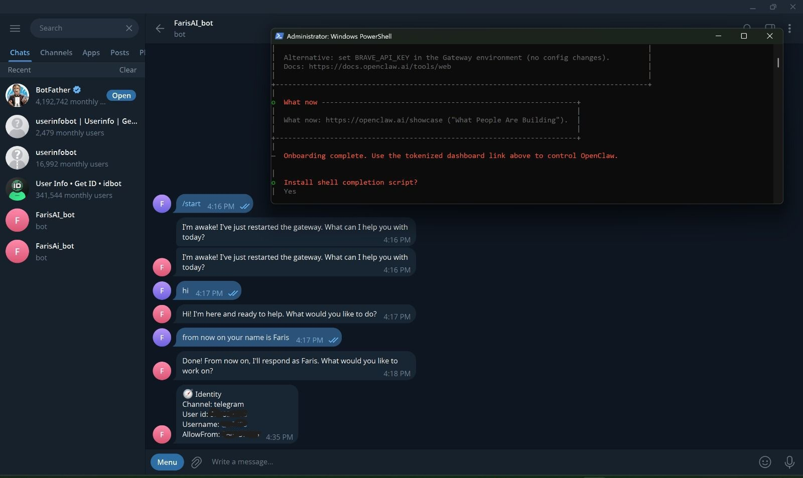

# OpenClaw Telegram AI Assistant 🤖

A personal AI assistant connected to Telegram using OpenClaw.

---

## 📌 Overview

This project is a personal AI assistant connected to Telegram using OpenClaw.

The project started by running OpenClaw and completing the required setup inside the OpenClaw platform. After that, I configured the assistant workflow, created a Telegram bot, retrieved the required Telegram user/chat ID, and added it inside OpenClaw to establish the connection.

Finally, I tested the assistant directly through Telegram to make sure the bot was connected successfully and responding as expected.

---

## ✨ Features

- Personal AI assistant connected to Telegram
- Telegram bot integration
- Assistant workflow configured inside OpenClaw
- Telegram user/chat ID connection setup
- Basic conversational interaction
- Bot testing through Telegram

---

## 🛠️ Tools & Technologies

- OpenClaw
- Telegram Bot
- PowerShell
- GitHub

---

## 🔄 Project Workflow

1. Ran OpenClaw
2. Completed the setup inside OpenClaw
3. Configured the AI assistant workflow
4. Created a Telegram bot
5. Retrieved the Telegram user/chat ID
6. Added the Telegram ID inside OpenClaw
7. Tested the bot through Telegram
8. Verified that the assistant responds correctly

---

## 📸 Screenshot

### Telegram AI Assistant Testing

---

## 🎯 What I Learned

Through this project, I practiced:

- Running and setting up OpenClaw
- Configuring an AI assistant workflow
- Connecting OpenClaw with Telegram
- Using Telegram ID for bot connection
- Testing AI assistant responses through Telegram
- Understanding how AI assistants can be connected to messaging platforms

---

## 🔐 Important Note

Sensitive information such as API keys, Telegram bot tokens, user IDs, chat IDs, gateway tokens, and private configuration values are not included in this repository.

---

